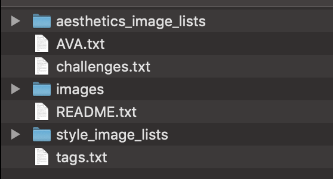
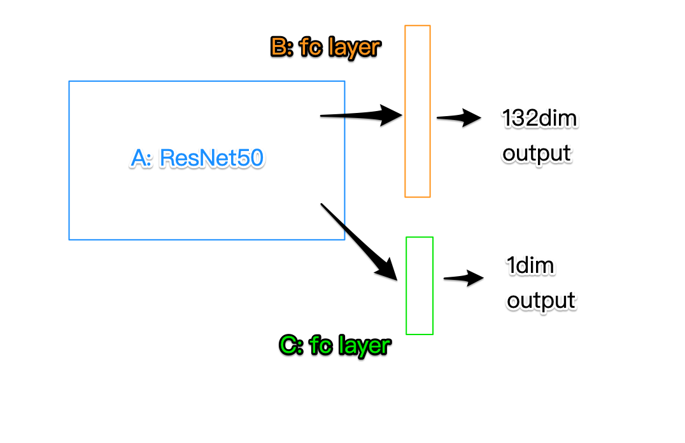

# Computational_Image_Aesthetic

## Table of Contents

* [AVA dataset](#ava-dataset)
* [Baseline Network](#baseline-network)
* [Aesthetic Network](#aesthetic-network)

## AVA dataset

    
  	

    	<em style="color:orange; border-bottom: 1px solid #d9d9d9;    display: inline-block;    color: #999;    padding: 2px;">数据集文件结构</em>

### AVA.txt

    
  	

    	<em style="color:orange; border-bottom: 1px solid #d9d9d9;    display: inline-block;    color: #999;    padding: 2px;">AVA.txt文件存储格式</em>

Total: about 250000 images

### tags.txt

    
  	

    	<em style="color:orange; border-bottom: 1px solid #d9d9d9;    display: inline-block;    color: #999;    padding: 2px;">tags.txt文件存储格式</em>

tag_id + tag_description

Total: 66 tags

### Related codes

`data.py`

## Baseline Network

### Data set

#### Tag - Classification Task

x: (batch_size, 224, 224, 3)

y: (batch_size, 132), in which 132 = 66 * 2. 66 is the number of tags.

Split data set 'tag':

- 0.96 train set

- 0.005 test set

- 0.005 validation set

#### Score - Regression Task

x: (batch_size, 224, 224, 3)

y: (batch_size, 1)

Split data set 'score':

- 0.96 train set
- 0.005 test set
- 0.005 validation set

### Architecture

    
  	

    	<em style="color:orange; border-bottom: 1px solid #d9d9d9;    display: inline-block;    color: #999;    padding: 2px;">baseline network</em>

### Related codes

`network_baseline.py` 

### Training log

#### Step1

Train A+B+output, and save weights.

#### Step 2

Read pre-trained-A, then train A+C+output

### Result 

AVA dataset binary classification accuracy ~ 0.3

## Aesthetic Network

### Data set

1. Check data set: remove lines with empty url in `AVA.txt` & create new url file `AVA_check.txt`
   
   - `check_data.py`
2. Split data set -> train set(url only) & test set & validation set in `./AVA_data_score_bi` or `./AVA_data_score`
   - `create_data.py`

3. Create training set with x_b-y_b-pair pkl in `./AVA_data_score_bi/train_raw` or `./AVA_data_score/train_raw`
   - `create_train_set.py`
   - write `batch_size`(<20) and `batch_index_max` to `cfg.ini`

### Training log

1. baseline network. Then save weights in `./model_baseline`
   - dataset-inputs: (?, 224, 224, 3); dataset-outputs: (?, 2)
   
   - `train_baseline.py`

2. comparator. Then save weights in `./model_cmp`
   - dataset-inputs: (?, 224, 224, 3) & (?, 224, 224, 3); dataset-outputs: (?, 3)
   - `train_comparator.py`
   
## Aesthetic Network v2

### Data set
1. Check data set: remove lines with empty url in `train.jpgl` + `test.jpgl`  & create new url file `train_check.txt` + `test_check.txt`
   - `check_data.py`

2. Split data set -> train set(url only) & test set & validation set in `./AVA_data_style` 
   - `create_data.py`