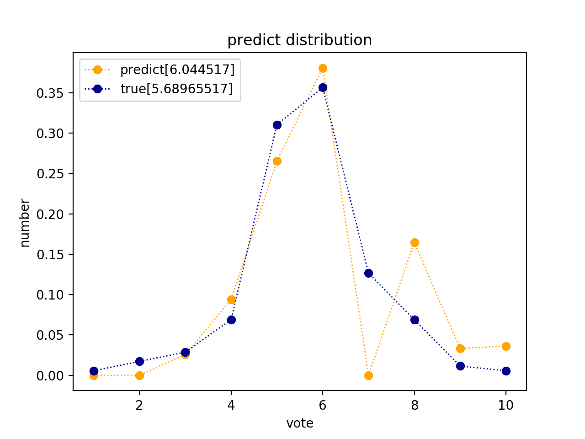
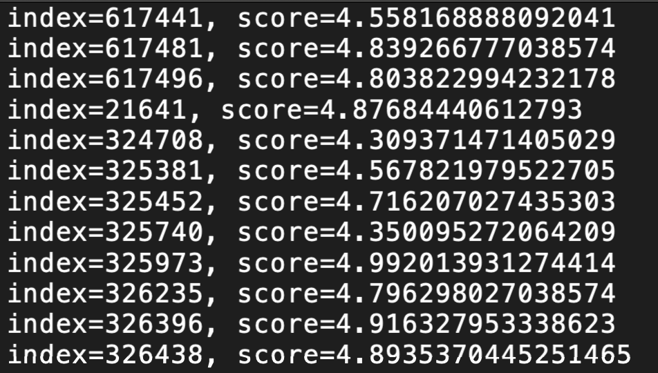
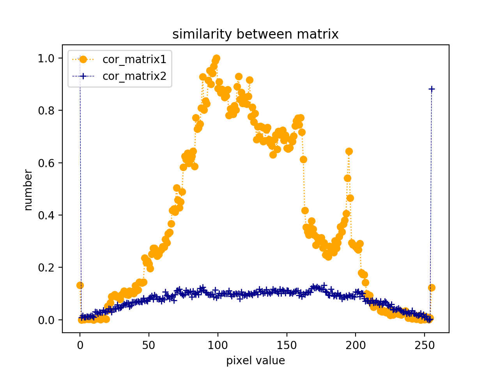

# Computational_Image_Aesthetic

## Table of Contents

* [AVA dataset](#ava-dataset)
* [Aesthetic Network](#aesthetic-network)

## AVA dataset

<p align="center">
    
  	<p align="center">
    	<em style="color:orange; border-bottom: 1px solid #d9d9d9;    display: inline-block;    color: #999;    padding: 2px;"><span id = "">数据集文件结构</span></em>
</p>


### AVA.txt

<p align="center">
    
  	<p align="center">
    	<em style="color:orange; border-bottom: 1px solid #d9d9d9;    display: inline-block;    color: #999;    padding: 2px;"><span id = "">AVA.txt文件存储格式</span></em>
</p>


Total: about 250000 images

### tags.txt

<p align="center">
    
  	<p align="center">
    	<em style="color:orange; border-bottom: 1px solid #d9d9d9;    display: inline-block;    color: #999;    padding: 2px;"><span id = "img1">tags.txt文件存储格式</span></em>
</p>


tag_id + tag_description

Total: 66 tags

### Related codes

`dataset.py`

## Aesthetic Network

### Data set

`dataset.py`

### Training log

1. set parameters in `config.ini`

- parameters which have settled: batch_index_max & batch_size

```ini
[parameter]
batch_index_max = 65
batch_size = 32
learning_rate = 0.0001
learning_rate_decay = 0.99
epoch = 23
alpha = 0.0004
beta = 0.004
gamma = 0.0007142857
theta = 0.001
```

2. Training `train.py`

   - Save model file to dir `model_MTCNN/`
     - `checkpoint`
     - `my_model.data-00000-of-00001`
     - `my_model.index`
     - `my_model.meta`
   - Save covariance matrixes to dir `model_MTCNN/`
     - `cov_matrix1.png`
     - `cov_matrix2.png`

3. calculate aesthetic score distribution for a image. `cal_distribution.py`

   - Input (dir=AVA_dataset/images/800749.jpg)

   - Output

     <p align="center">
         
       	<p align="center">
         	<em style="color:orange; border-bottom: 1px solid #d9d9d9;    display: inline-block;    color: #999;    padding: 2px;"><span id = "">predict and true score distribution for 800479.jpg</span></em>
     </p>

4. calculate aesthetic score for a set of images. `cal_score.py`

   - Input (dir=AVA_dataset/images/)

   - Output

     <p align="center">        <p align="center">      <em style="color:orange; border-bottom: 1px solid #d9d9d9;    display: inline-block;    color: #999;    padding: 2px;"><span id = "">predict score for images in dataset</span></em></p>

5. calculate covariance between matrixes

   - Input (dir=model_MTCNN) `cov_matrix1.png`and `cov_matrix2.png`

   - Output 

     <p align="center">
         
       	<p align="center">
         	<em style="color:orange; border-bottom: 1px solid #d9d9d9;    display: inline-block;    color: #999;    padding: 2px;"><span id = "">covariance between matrixes</span></em>
     </p>